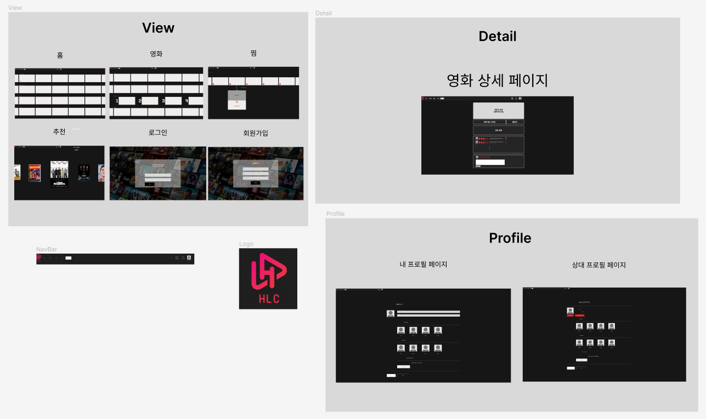
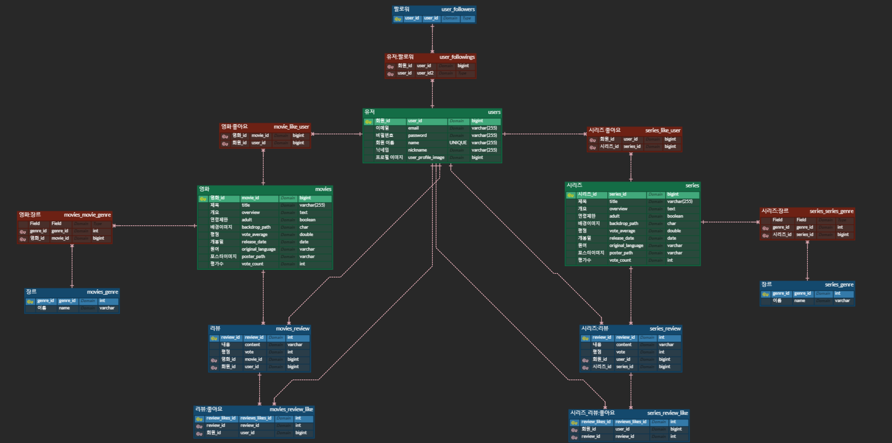
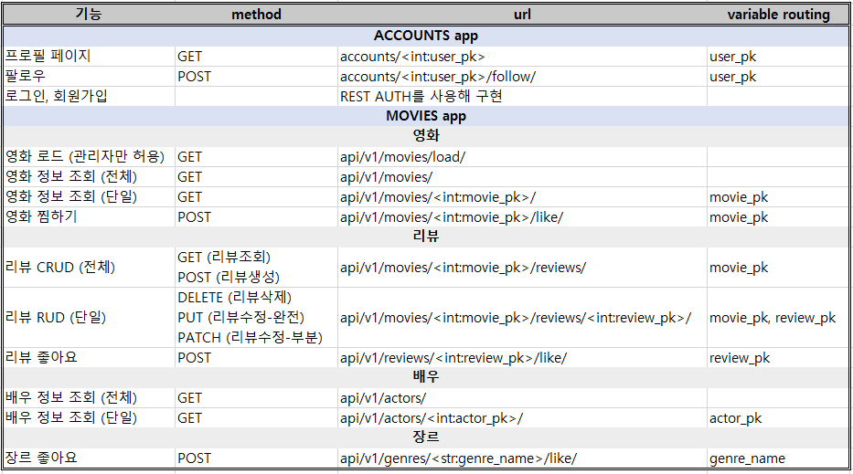

<h1>HLC 영화 추천 Web Service</h1>

 

## 1. 프로젝트 소개
#### 1) 개발 기간
📅  2024. 05. 16 ~ 05. 24 (9일)

#### 2) 프로젝트 내용
- 가입한 회원을 대상으로 한 유저 기반 **맞춤 영화 추천 웹 사이트**
- 영화 정보 제공 (영화 인기 순위, 장르별 영화 리스트, 영화 예고편 영상, 줄거리 등)

#### 3) 기술 스택

  
  
  
   
  
  
  
  
  
   
  
  
  

#### 4) 개발 인원
황준, 최지원, 이지안

 

## 2. 주요 기능 -> 사용 영상 넣기( )
### 1) 회원가입

### 2) 로그인

### 3) 로그아웃 및 비로그인 유저 기능 제한
- 로그인 하지 않은 유저는 메인페이지에 접근할 수 없음

### 4) 메인 페이지 (홈)
- 화면 상단에 동영상 어쩌구~~~~~~~~~~~
- 추천 알고리즘을 기반으로 한 영화 리스트를 화면에 표시함
- 영화에 커서를 올리면 영화 예고편 영상과 간단한 설명을 볼 수 있음
- 우측 상단 검색 기능 : 영화 제목, 출연진으로 검색 가능 (navigation bar에 검색창이 있어 회원가입 및 로그인 페이지를 제외한 모든 페이지에서 검색 가능)

### 5) 영화 목록 페이지
- 상단 네비게이션바의 ~~를 누르면 페이지에 들어갈 수 있음
- 전체 영화 인기순위를 볼 수 있음
- 장르별 영화 리스트를 볼 수 있음
- 영화에 커서를 올리면 영화 예고편 영상과 간단한 설명을 볼 수 있음

### 6) 영화 상세 페이지
- 영화 예고편 영상과 출연진, 영화 설명, 평점, 리뷰, 리뷰에 대한 좋아요 수를 볼 수 있음
- 별점 및 리뷰 작성, 리뷰 좋아요 가능

### 7) 유저기반 맞춤 영화 추천
- 상단 네비게이션바의 추천 누르면 페이지에 들어갈 수 있음
- 무슨 알고리즘 사용했는지 적기

### 8) 찜한 영화 페이지
- 찜한 영화 리스트를 볼 수 있음
- 하트를 다시 누르면 찜한 리스트에서 삭제 가능
- 영화에 커서를 올리면 영화 예고편 영상과 간단한 설명을 볼 수 있음

### 9) 유저 프로필 페이지
- 본인의 프로필페이지에 들어가면 프로필, 선호하는 장르 수정 가능
- 타인의 프로필페이지에 들어가면 follow 및 follow 취소 가능
- following, follower 목록을 볼 수 있음

 

## 3. 서비스 설계
### 1) 와이어프레임 

### 2) 데이터 베이스 모델링 (ERD)

- [ERD Cloud Link](https://www.erdcloud.com/d/SqN2RmTDs2krrb6ji) 

### 3) django URL 명세서

### 4) Vue 컴포넌트 구조

### 5) 팀원 및 업무분담
|팀원|업무|
|:---:|:---:|
|황준|여기 내용 적기|
|최지원|여기 내용 적기|
|이지안|여기 내용 적기|

 

## 4. 후기
#### 👽 황준
여기 후기 적기 (시행착오, 해결한 방법도 포함)
#### 👽 최지원
여기 후기 적기 (시행착오, 해결한 방법도 포함)
#### 👽 이지안
실제 프로젝트를 진행해보니 코드를 작성하는 것 외에도 할 일이 무수히 많다는 것을 알게되었다. 그리고 짧은 코드를 작성해도 해결할 오류가 굉장히 많다는 것을 다시 한 번 또 깨달았다.
