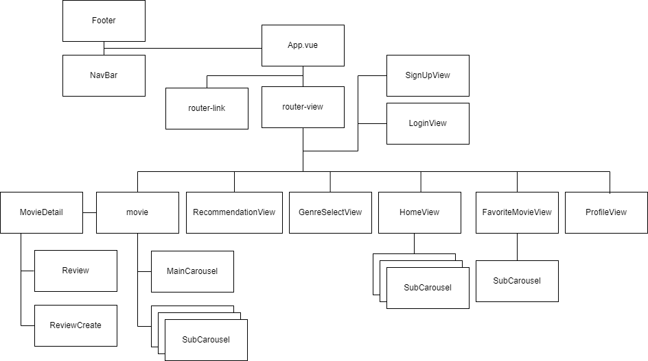

<h1>HLC 영화 추천 Web Service</h1>

 

## 1. 프로젝트 소개
#### 1) 개발 기간
📅  2024. 05. 16 ~ 05. 23 (8일)

#### 2) 프로젝트 내용
- 가입한 회원을 대상으로 한 유저 기반 **맞춤 영화 추천 웹 사이트**
- 영화 정보 제공 (영화 인기 순위, 장르별 영화 리스트, 영화 예고편 영상, 줄거리 등)

#### 3) 기술 스택

  
  
  
   
  
  
  
  
  
   
  
  
  

#### 4) 개발 인원
황준, 최지원, 이지안

 

## 2. 주요 기능
### 1) 회원가입

### 2) 로그인 및 로그아웃
- 비로그인 유저는 기능이 제한되어 메인페이지에 접근할 수 없음

### 3) 선호하는 장르 선택
- 영화 추천 알고리즘의 기반이 될 데이터 수집

### 4) 메인 페이지 및 유저기반 맞춤 영화 추천
- 선호하는 장르를 기반으로 추천된 영화의 포스터들을 장르별로 볼 수 있음
- 포스터 위에 커서를 올리면 예고편 영상과 chat GPT로 생성된 영화 설명을 볼 수 있음

### 5) 영화 상세 페이지
- 영화 포스터를 누르면 영화 상세페이지를 볼 수 있음
- 영화 예고편 영상과 출연진, 영화 설명, 평점, 리뷰, 리뷰에 대한 좋아요 수를 볼 수 있음
- 별점 및 리뷰 작성, 리뷰 좋아요를 할 수 있음 (하트를 다시 누르면 리뷰 좋아요를 취소할 수 있음)
- 영화 찜하기를 할 수 있음 (하트를 다시 누르면 찜한 리스트에서 삭제 가능)

### 6) 영화 순위 페이지
- 인기도를 기준으로 상위 1위에서 10위까지의 영화 리스트를 볼 수 있음
- 사진에 커서를 올리면 영화예고편을 볼 수 있음
 

### 7) 찜한 영화 페이지
- 찜한 영화 리스트를 볼 수 있음
- 하트를 다시 누르면 찜한 리스트에서 삭제 가능
- 영화에 커서를 올리면 영화 예고편 영상과 간단한 설명을 볼 수 있음

### 8) 유저 프로필 페이지
- 본인의 프로필페이지에 들어가면 프로필, 선호하는 장르 수정 가능
- 타인의 프로필페이지에 들어가면 follow 및 follow 취소 가능
- following, follower 목록을 볼 수 있음

 

## 3. 서비스 설계
### 1) 와이어프레임 

### 2) 데이터 베이스 모델링 (ERD)

- [ERD Cloud Link](https://www.erdcloud.com/d/SqN2RmTDs2krrb6ji) 

### 3) django URL 명세서

### 4) Vue 컴포넌트 구조

### 5) 팀원 및 업무분담

 

## 4. 후기
#### 👽 황준
1. 캐러셀 구현  
시중에 풀려있는 캐러셀 플러그인은 많았으나, 그 중 vue3를 지원하는 캐러셀이 많지 않아, 그 중 가장 유명한 플러그인을 가지고 와서 사용했으나, 미숙한 부분이 많이 있었고, 영어로 된 정보가 대부분이라 모르는 부분이 있어도 참고하기가 쉽지 않았습니다.
2. JavaScript의 비동기 처리  
많은 컴포넌트에서, onMount를 처리하기 전에 페이지를 불러오거나 해서, 정보가 갱신되지 않다가, 새로고침을 해야 정보가 갱신 되는 등의 문제가 있었습니다. 이를 watch함수를 사용하거나, navigation guard를 사용하여 동기적으로 동작하게 만들었습니다.
3. 마우스 오버 시의 영화 간략 상세창  
기본적으로 넷플릭스를 참고해서 만들었기 때문에, 반드시 구현해야 할 기능이라고 생각해서 넣었으나, 기존창에 반투명한 창을 덮어 씌운다음 그 위에 작업을 해야 했고, 그 각각의 요소가 캐러셀 내부의 아이템이라, 그 부분도 생각해야 해서 좀 어려웠습니다.

#### 👽 최지원
1. 특정 구현 방식에 집착하지 않기  
Modal을 사용하여 Movie 디테일 창을 띄우려 했으나, Vue3에서 부모-자식 컴포넌트 관계를 제대로 읽지 못해 해당 기능 구현이 어려웠다. 대신 RouterView와 뒤로 가기 기능을 활용하여 유사한 기능을 구현했다. 팀 협업 프로젝트에서는 적은 노력으로 비슷한 결과를 내는 방식을 선택하는 것이 중요하며, 요구사항과 발표일(출시일)을 고려해야 한다.
2. E-R 다이어그램 설계와 URL 명세서 작성의 중요성  
초기에는 E-R 다이어그램 설계 방법을 몰라서 많은 어려움을 겪었다. 이 다이어그램을 왜 작성해야 하는지 의문이 들었지만, 실제로 백엔드 작업을 해보니 E-R 다이어그램과 URL 명세서를 확실히 작성하고 작업하는 것이 프로젝트 요구사항에 맞게 백엔드를 잘 구현하는 데 큰 도움이 되었다.

#### 👽 이지안
1. 설계 및 Project Managing의 중요성  
실제 프로젝트를 진행해보니 설계 단계부터 꼼꼼히 만드는 것이 코드 작성 시간을 훨씬 더 줄여줄 것이라는 생각이 들었다.
얼마나 꼼꼼히 할지, 어디에 얼마나 시간을 투자해야 하는지를 적절히 계획하여 분배해야 한정된 시간에서 최선의 아웃풋을 낼 수 있다는 것을 깨달았다. 
또한 코드를 작성하는 것 외에도 할 일이 무수히 많다는 것을 알게 되었다.
2. 오류 해결  
짧은 코드를 작성해도 해결할 오류가 굉장히 많고 작은 오류라도 해결을 위해 들어가는 시간이 아주 길 수도 있다는 것을 깨달았다. 이런 시간을 줄이기 위한 방법들을 앞으로 계속해서 고민해 보아야겠다.
